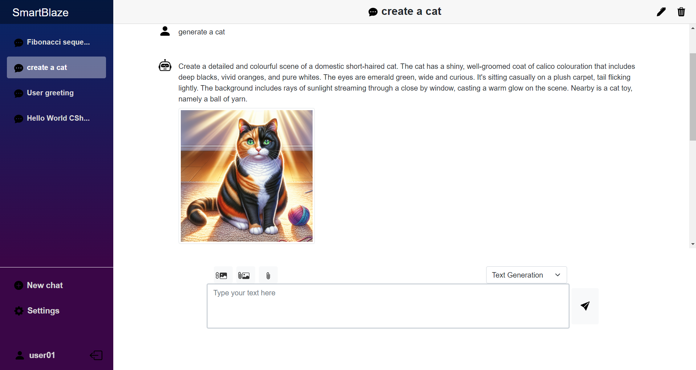
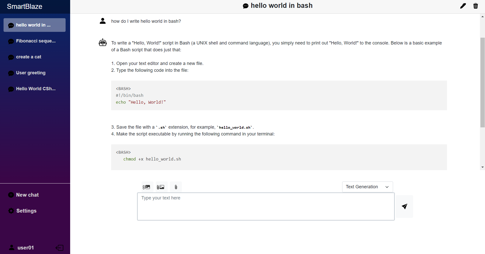

# SmartBlaze

**SmartBlaze** is an application designed to integrate with AI models such as OpenAI's ChatGPT and Google's Gemini. It was developed as part of the university thesis project, drawing inspiration from Chatbox (https://github.com/Bin-Huang/chatbox).
The application is mainly built with C# using Blazor and ASP.NET Core as its core frameworks.





## Features and Capabilities

- **Interactive and smooth user interface** to manage multiple conversations with chatbots.
- **Customizable sessions**, allowing you to set system instructions to define chatbot behavior and adjust temperature to control the chatbot's creativity.
- **Wide selection of AI models** from OpenAI and Google Gemini, offering more options to choose from.
- **Text stream activation** for a more interactive conversation experience with the chatbot.
- **Code highlighting** for various programming languages, enhancing readability and presentation.
- **Image generation** capabilities using OpenAI's DALL-E models.
- **Image analysis** by the chatbot with the ability to add images for processing (image vision).
- **File upload** support, allowing the chatbot to access and analyze the contents of various types of files.
- **Cloud-based chat and configuration storage**, enabling you to resume conversations across multiple devices.

## How to Use the Application

To use SmartBlaze, you need an API key to interact with the chatbot models. You can obtain an API key from AI model providers like OpenAI and Google.

### Setup

1. **Clone the Repository**
   - Open a terminal and execute the following command:
     ```bash
     git clone https://github.com/zephyrquest/smartblaze.git
     ```
   - Navigate to the `publish/SmartBlaze` folder where the script files are located:
     ```bash
     cd smartblaze/publish/SmartBlaze
     ```
   - Inside this folder, you will find two script files:
     - `smartblaze.bat` (for Windows)
     - `smartblaze.sh` (for macOS/Linux)

### Starting the Application

#### For Windows

2. **Run the Batch File**
   - Open Command Prompt and navigate to the folder containing `smartblaze.bat`.
   - Run the batch file by executing:
     ```batch
     start smartblaze.bat
     ```
   - Alternatively, you can simply double-click on `smartblaze.bat`.
   - The script will automatically open your default web browser and navigate to:
     ```
     https://localhost:7040
     ```

#### For macOS or Linux

2. **Run the Shell Script**
   - Open a terminal and navigate to the folder containing `smartblaze.sh`.
   - Ensure the script has execution permissions. If not, run:
     ```bash
     chmod +x smartblaze.sh
     ```
   - Start the application by executing the script:
     ```bash
     ./smartblaze.sh
     ```
   - The script will open your default web browser and navigate to:
     ```
     https://localhost:7040
     ```

### Authentication

3. **Log In or Register**
   - If you are using the application for the first time, you will need to register a new user account.
   - Click on the "Register" button and fill in the required details, including a username and password.
   - If you already have an account, click on "Log In" and enter your credentials.

### Configuration

4. **Set the API key**
   - In the application, go to Settings and set the API key you have obtained for each chatbot you want to use.

### Important Notes

- **API Key**: Ensure you have obtained an API key from OpenAI or Google before using the chatbot functionality.
- **Browser Compatibility**: For the best experience, use a modern web browser like Chrome, Firefox, or Edge.
- **Certificate Issue**: If you encounter the issue where you are unable to configure HTTPS endpoint because no server certificate was specified when launching the application, you may check [this link](https://stackoverflow.com/questions/53300480/unable-to-configure-https-endpoint-no-server-certificate-was-specified-and-the) for the solution.
